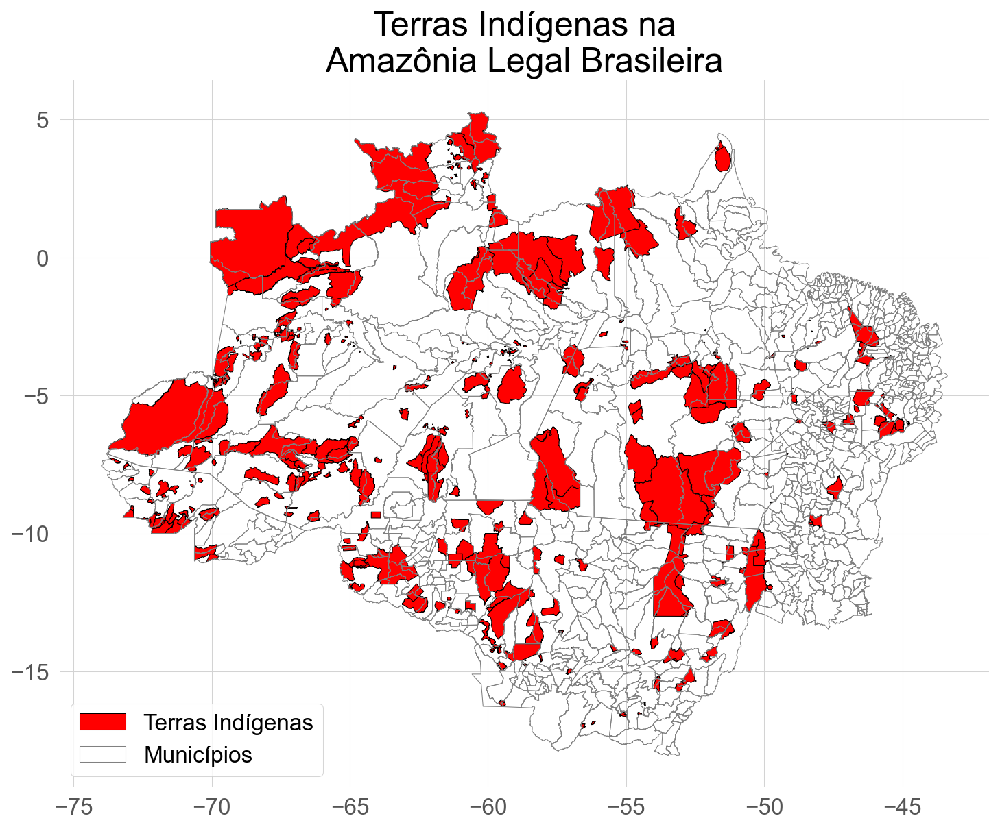

# Terras Indígenas na Amazônia Legal Brasileira

## Introdução

### Localização das Terras Indígenas

### Próximos passos

- Nomes das terras indígenas;
- Quantas e quais etnias;
- Onde etnias se concentram;
- Quantos municípios da ALB possuem terras indígenas;
- Número de terras indígenas por estado e por municípios;
- Superfície de terras indígenas por estado e por município;
- Cobertura percentual de terras indígenas por estado e por munícipio.